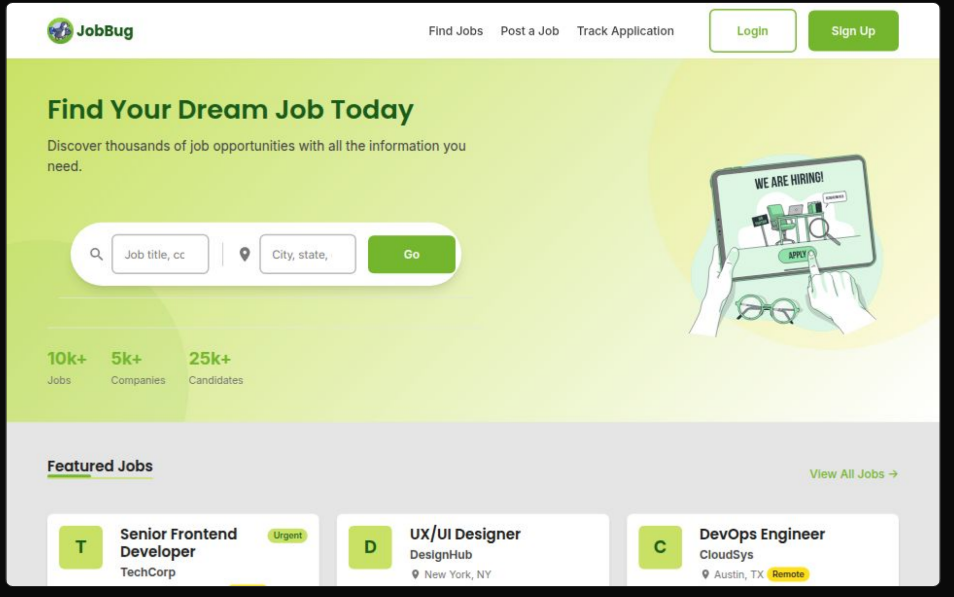

# JobBug - Modern Job Board Platform

JobBug is a comprehensive job board platform that seamlessly connects job seekers with employers. Built with a modern tech stack, JobBug features an intuitive interface for job searching, application tracking, and job posting.

## Features

- **Advanced Job Search** - Filter jobs by multiple criteria including location, job type, and salary range
- **Real-time Application Tracking** - Monitor application status from submission to decision
- **Smart Job Matching** - Find the best fit based on skills and preferences
- **User Authentication** - Secure login via email or Google account
- **Responsive Design** - Optimized experience across all devices
- **Job Posting Interface** - Effortless job creation for employers

## Tech Stack

### Frontend

- React.js
- Firebase Authentication
- Modern CSS

### Backend

- Django REST Framework
- PostgreSQL
- Firebase Admin SDK

### DevOps

- Docker
- AWS
- CI/CD Pipeline

## Architecture

JobBug follows a microservices architecture with separate repositories for frontend and backend components. The system leverages Firebase for authentication and PostgreSQL for data persistence, with all components containerized using Docker.

## License

This project is licensed under the MIT License - see the [LICENSE](LICENSE) file for details.

## Contributing

JobBug is now open source! Contributions are welcome. Please feel free to submit a Pull Request.

---

Developed with ❤️ by Anton Luckshman
